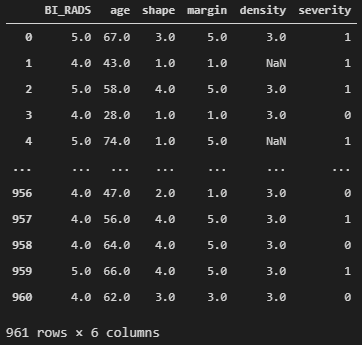
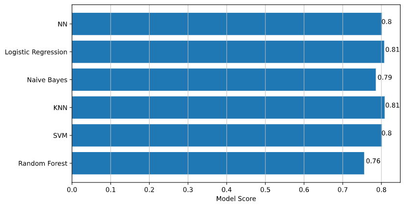

# Classification of benign and malignant mammographic masses

  

Classification of benign and malignant mammographic masses using UCI Mammographic Mass Data Set (source: https://archive.ics.uci.edu/ml/datasets/Mammographic+Mass)

This data contains 961 instances of masses detected in mammograms, and contains the following attributes:

   1. BI-RADS assessment: 1 to 5 (ordinal)  
   2. Age: patient's age in years (integer)
   3. Shape: mass shape: round=1 oval=2 lobular=3 irregular=4 (nominal)
   4. Margin: mass margin: circumscribed=1 microlobulated=2 obscured=3 ill-defined=4 spiculated=5 (nominal)
   5. Density: mass density high=1 iso=2 low=3 fat-containing=4 (ordinal)
   6. Severity: benign=0 or malignant=1 (binominal)
   
BI-RADS is an assesment of how confident the severity classification is; it is not a "predictive" attribute and so it will be discarded. The age, shape, margin, and density attributes are the features that will be used to build the model with, and "severity" is the classification we will attempt to predict based on those attributes.

  

Several different machine learning techniques were applied to this data set to see which one yields the highest accuracy as measured with K-Fold cross validation (K=10):

* Decision tree
* Random forest
* KNN
* Naive Bayes
* SVM
* Logistic Regression
* Neural network

Results were as follows:

  

As we can see, most models produced more or less equal results. 
Logistic regression looks good due to high score and simplicity. KNN with K = 84 is just slightly better. Decision trees are the least accurate.
